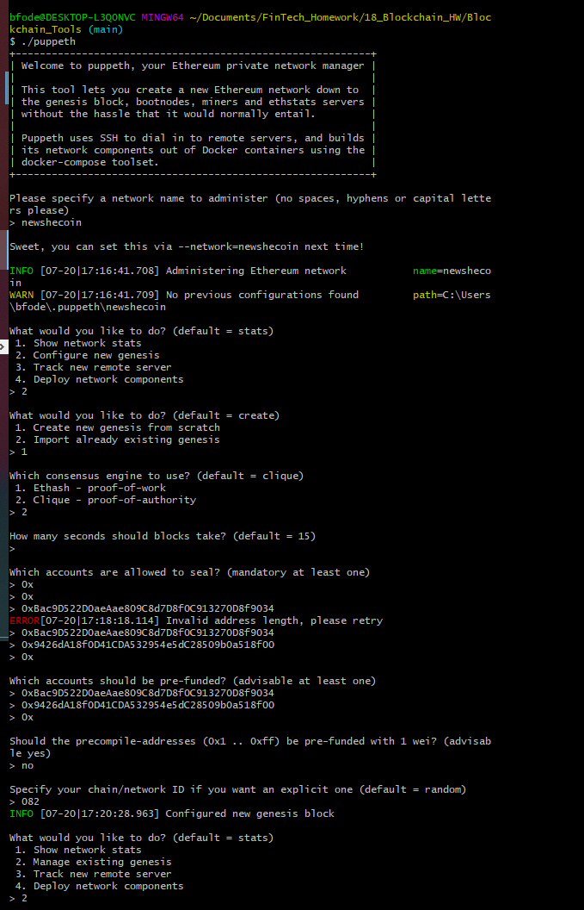
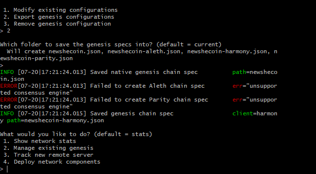
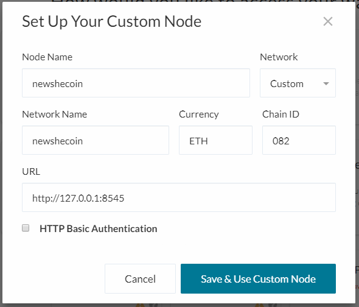
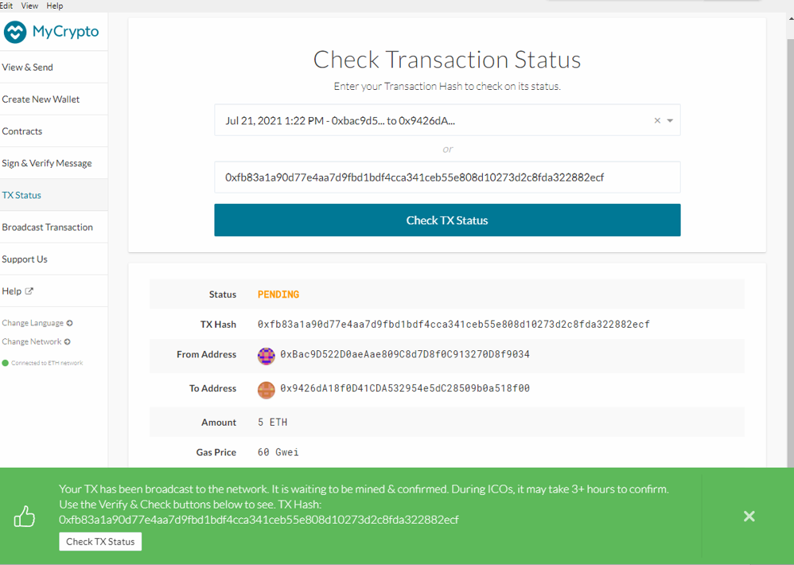
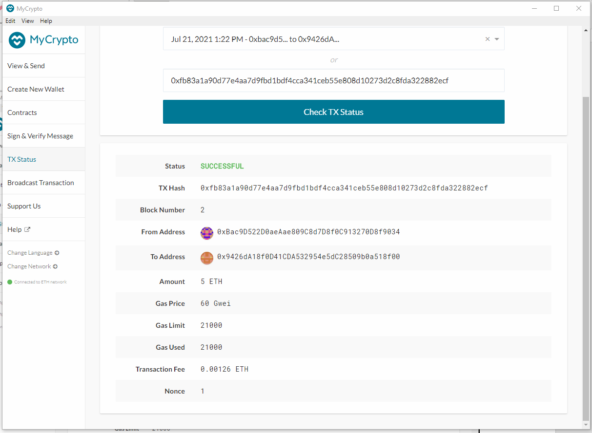

# 18_Blockchain_HW
To start your block on a POA algorithm, you need to create two account that will be seal and prefunded during the puppeth configuration. To create this two account or node you will use the following command. 

### code for creating new account 
* ./geth --datadir node1 account new
* ./geth --datadir node2 account new

you will need to save your Public address of the key for both node1 and node2.

Puppeth configuration
For this section we will use puppeth which comes with the blockchain download.

### code for executing puppeth
* ./puppeth

The following prompt will come up
- specify your network name.
- Select 2 to configure genesis block.
- Select 1 to create new genesis from scratch.
- Select 2 for Clique - proof-of-authority.
- Click enter to select the default time which is 15mins.
- Past in node 1 and 2 address for account allowed to be sealed.
- Past in node 1 and 2 address for account to be pre-funded.
- Select 2, manager existing genesis.
- Export genesis configuration.

init node
  
## Connecting to the network
while you node are running open Crypto account,
scroll to the button of the page and click change network to change to the your network.
Then select the keystore 

setting up custom node
 - Node name: is the name of the network you selected during puppet configuration.
 - Network name: is the name of the network.
 - Network: scroll down in the drop box and select custom.
 - Port: we are going to use http://127.0.0.1:8545
 - The click save and use custom node.

  

  Click change network again to change to the new network you just created.

Check Transaction status.
after submitting a transactin

  

Transaction sucessfully sent confirmation
  